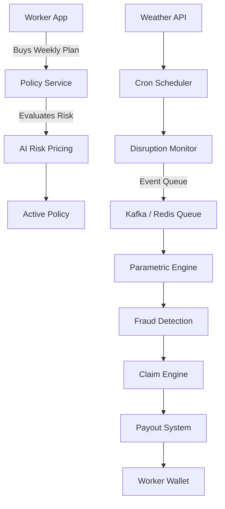
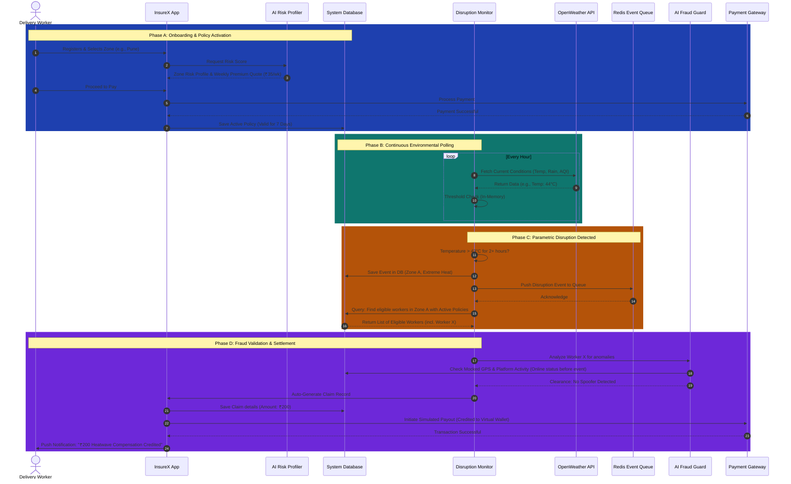

# 🦄 InsureX: AI-Powered Parametric Insurance for the Gig Economy

**InsureX is an AI-powered parametric insurance platform that protects gig workers from income loss during extreme weather disruptions through automated real-time payouts.**

**Team Name:** InsureX  
**Hackathon:** Guidewire DEVTrails 2026   

---

## 🎯 1. The Problem Space & Persona

**Chosen Persona:** Food & Q-Commerce Delivery Partners (e.g., Zomato, Swiggy, Zepto).

**The Problem:**
Delivery partners in India rely on daily wages derived directly from task completion. When severe external disruptions occur (like extreme heatwaves, heavy monsoons, or sudden pollution spikes), order volumes drop, local delivery zones are closed, or it becomes physiologically dangerous to work. These workers lose 20-30% of their weekly income with zero safety net. Existing micro-insurance policies strictly cover accidental death, vehicle damage, or medical bills—they **do not** cover loss of earnings due to uncontrollable weather or social events.

---

## 💡 2. Core Solution

InsureX is an **AI-Enabled Parametric Insurance Platform** that acts as an income safety net for delivery workers during specified external disruptions. 

Instead of relying on manual claim submissions, slow assessments, and long approvals, InsureX uses real-time third-party API data to **automatically detect disruptions, trigger claims, and simulate instant payouts** to the worker's wallet when predefined thresholds are met.

---

## 🤔 3. Why Parametric Insurance?

Traditional insurance requires manual claim submission and verification, often taking days or weeks to process. Parametric insurance eliminates this friction by using predefined external triggers.

`Weather Data → Threshold Met → Automatic Payout`

**Benefits:**
* **No manual claims:** Eliminates administrative overhead.
* **Instant settlement:** Gig workers get compensated the same day.
* **Transparent rules:** Trust is built because payout parameters are mathematically predefined.
* **Scalable for gig economies:** Designed to handle thousands of concurrent micropayments automatically.

---

## 💰 4. The Weekly Premium Model

Gig workers operate on a weekly earnings cycle. Therefore, our financial model is strictly built on a **Weekly Subscription Plan**.

* **Dynamic AI Pricing:** Premiums are not a flat rate. Our AI Risk Assessor calculates the premium dynamically at the start of each week.
  * *Example:* A worker in a low-lying, flood-prone zone in Mumbai during July will have a dynamically adjusted premium compared to a worker in a stable environment.
* **Adaptive Premium Pricing (Seasonal & Risk-Based):** 
  * *Formula:* `Premium = BaseRate × RiskScore × SeasonalFactor`
  * *Example:* Extreme weather season → premium increases slightly; Stable weather → premium decreases. Demonstrates true AI-driven underwriting.
* **Auto-Renewal & Active Coverage:** Workers maintain an active weekly balance. If the policy is active during a parametric event, they are covered. If expired, coverage pauses.

---

## 💼 5. Business Sustainability

**How does this system remain financially sustainable?**
InsureX operates on a **Risk Pool Model**. The collected premiums from all active workers create a shared fund that finances payouts for those specifically affected by localized disruptions.

* **Example Scenario:**
  * 100 workers × ₹40 premium = **₹4000 total pool** for the week.
  * A localized heavy rain event disrupts 10 workers in a specific zone.
  * 10 workers × ₹200 payout = **₹2000 total payout**.
  * **Remaining pool = ₹2000**.
This demonstrates a realistic, mathematically sound insurance model where probability and pooled risk ensure system solvency.

---

## ⚡ 6. Parametric Triggers (Automated Claims)

Claims in InsureX are generated automatically without human intervention. Our Phase-2 MVP focuses on 3 primary disruption triggers, monitored continuously:

1. **Extreme Heat (Environmental):**
   * *Trigger Condition:* Temperature > 43°C (or Heat Index > 46°C) for 2+ consecutive hours in the worker's active zone.
   * *Payout Logic:* Automated partial compensation to cover the assumed drop in delivery volume (e.g., ₹150 - ₹200 payout).
2. **Heavy Rainfall / Waterlogging (Environmental):**
   * *Trigger Condition:* Rainfall > 50mm within a 3-hour window.
   * *Payout Logic:* Instant payout triggered to offset lost peak-hour deliveries.
3. **Platform Outage / App Crash (Social):**
   * *Trigger Condition:* Delivery platform API downtime > 30 minutes.
   * *Impact:* Workers cannot receive orders.
   * *Payout Logic:* ₹150 fixed compensation to offset the lost operating window.

---

## 🧠 7. AI / ML Integration Strategy

Artificial Intelligence is woven directly into the core workflow via three core modules:

1. **Risk Profiling AI (Underwriting & Pricing):** Dynamically generates proactive risk profiles and individual weekly premium quotes.
   * **Risk Model Inputs:** Historical rainfall frequency, heatwave frequency, flood risk zones, delivery density, seasonal patterns.
   * **Model Output:** `RiskScore (0-1)` and `Weekly Premium Recommendation`.
2. **AI Disruption Prediction:** Instead of only reacting to weather, the AI forecasts upcoming disruptions.
   * *Example:* An AI Forecast Model predicts tomorrow's heat probability = 82%. The system automatically informs the worker: *"High heat risk tomorrow. Coverage recommended."* This demonstrates proactive, predictive insurance.
3. **Fraud Guard (Anomaly Detection):** Before any parametric payout is released, the AI evaluates the claim context to prevent system abuse.
   * *Checks include:* Does the worker's mocked GPS coordinate history match the weather event zone? Is this an impossible duplicate claim? Were they "offline" on the delivery app the entire day prior to the weather event (indicating no original intent to work)?

---

## 🔄 8. Platform Workflow (User Journey)

1. **Onboarding:** Delivery partner registers, providing their city, zone, and primary platform (e.g., Swiggy).
2. **AI Quote Generation:** The system profiles the risk and offers a tailored Weekly Premium (e.g., ₹35/week).
3. **Active Coverage:** The worker pays the premium via a mock wallet. Coverage is activated for 7 days.
4. **Hourly Monitoring:** The InsureX backend continuous-polling service checks climate/social APIs.
5. **Disruption Hits:** Temperature in the worker's zone reaches 45°C. System flags a `Disruption Event`.
6. **Trigger & Fraud Check:** System verifies the worker's policy is active and their GPS location matches the affected zone.
7. **Smart Settlement:** A claim is auto-generated. ₹200 is credited instantly to the worker's virtual wallet.

---

## 🏗️ 9. Technical Architecture & Stack

### Tech Stack
* **Frontend:** React / Next.js, Tailwind CSS (Worker App + Admin Dashboard)
* **Backend:** Python (Flask or Django)
* **Database:** MongoDB (or PostgreSQL / SQLite depending on framework choice)
* **AI/ML:** Python (Scikit-learn, Pandas) integrated directly within the backend
* **Message Queue:** Redis / Kafka (for asynchronous claim burst processing)
* **APIs:** OpenWeather API, Payment Sandbox (UPI simulator/Razorpay test mode)

### High-Level Flow (Simplified)

### Observability & Logging
System logs disruption detection, claim triggers, and payout transactions for auditability and regulatory compliance.

---

## 🗄️ 10. Database Schema Design

**1. Workers Collection**
* `worker_id` (PK)
* `name`, `city`, `delivery_platform` (Zomato/Swiggy)
* `wallet_balance`

**2. Policies Collection (Weekly)**
* `policy_id` (PK)
* `worker_id` (FK)
* `weekly_premium` (₹)
* `start_date`, `end_date`
* `status` (Active/Expired)

**3. Events Collection (Disruptions)**
* `event_id` (PK)
* `zone/city`
* `event_type` (Heat/Rain/Outage)
* `threshold_value` (e.g., 45°C)
* `timestamp`

**4. Claims Collection**
* `claim_id` (PK)
* `worker_id` (FK)
* `event_id` (FK)
* `payout_amount`
* `status` (Approved/Flagged/Paid)

---

## 🚀 11. Detailed System Workflow

The following outlines the exact step-by-step sequence of events from a worker joining the platform to receiving an automated payout during a disruption.

### Phase A: Onboarding & Policy Activation
1. **Worker Registration:** The delivery partner signs up on the InsureX app, connecting their delivery platform ID (e.g., Swiggy ID) and primary operating zone.
2. **AI Underwriting:** The backend calls the `Risk Profiling AI`, passing the worker's zone and historical weather data. The AI calculates a customized risk score.
3. **Quote Generation:** Based on the risk score, the system generates a Weekly Premium quote (e.g., ₹35/week for Mumbai vs. ₹20/week for Pune).
4. **Payment & Activation:** The worker pays the premium via the integrated simulated payment gateway. A `Policy` record is created in the database, setting the `status` to Active for exactly 7 days.

### Phase B: Continuous Monitoring
5. **Hourly Polling:** A `Cron Scheduler` service fetches real-time data from the OpenWeather API every 60 minutes for all active zones and passes it to the `Disruption Monitor`.
6. **Threshold Check:** Weather readings are evaluated in-memory. Only when a parametric threshold is breached is a disruption event persisted to the `Events` database.

### Phase C: Disruption & Parametric Trigger
7. **Threshold Breach:** The monitor detects that the temperature in Zone A has hit 44°C at 2:00 PM.
8. **Duration Tracking:** At 4:00 PM, the system confirms the temperature has remained above 43°C for 2 consecutive hours.
9. **Event Queueing:** A formal `Disruption Event` is declared and pushed to a lightweight event queue (e.g., Redis Queue) to ensure scalable claim processing.
10. **Eligibility Check:** The `Parametric Engine` processes the queue, querying the database for all workers assigned to Zone A whose policies are currently "Active".

### Phase D: Fraud Validation & Payout
11. **Fraud Guard Assessment:** For each eligible worker, the Engine sends a request to the `AI Fraud Detection` layer.
    * It checks the worker's mocked GPS logs (Are they actually in Zone A?).
    * It checks activity logs (Were they online and taking orders before the heatwave, or did they take the day off?).
12. **Claim Generation:** If the fraud check passes, a `Claim` record is automatically generated with the pre-calculated payout amount (e.g., ₹200).
13. **Instant Settlement:** The `Payout Simulator` executes the transaction through the payment gateway API.
14. **Wallet Credit & Notification:** The worker's InsureX wallet is credited, and they receive a push notification: *"Heatwave Disruption Auto-Claim Processed. ₹200 credited to your wallet."*

---

## 🗺️ 12. Workflow Sequence Diagram

