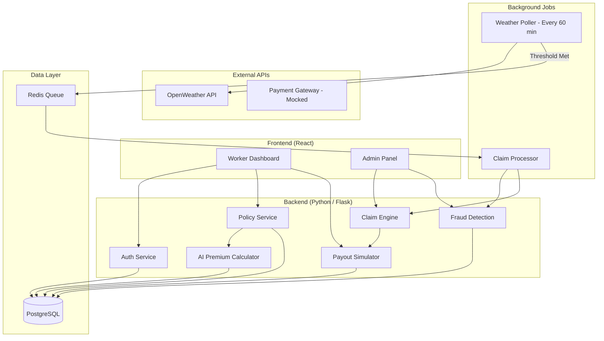
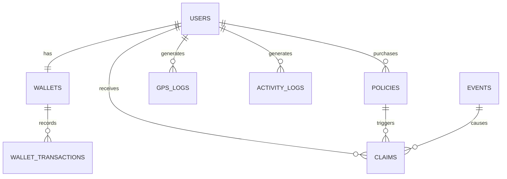

# InsureX: Complete System Design Document

---

## 1. High-Level Architecture



### Component Interaction Summary

| Component | Role | Talks To |
|---|---|---|
| **Worker Dashboard** | Registration, buy policy, view claims/wallet | Auth, Policy, Payout APIs |
| **Admin Panel** | View all claims, flagged fraud, analytics | Claim, Fraud APIs |
| **Auth Service** | Register/login workers | PostgreSQL |
| **Policy Service** | Create weekly policies, calculate premium | AI Premium Calculator, DB |
| **AI Premium Calculator** | Risk scoring + dynamic pricing | DB (historical weather data) |
| **Weather Poller** | Cron job, fetches weather every 60 min | OpenWeather API, Redis Queue |
| **Claim Processor** | Picks events from queue, runs eligibility | Fraud Detection, Claim Engine |
| **Fraud Detection** | Multi-layer validation | DB (GPS, activity logs) |
| **Payout Simulator** | Credits wallet, logs transaction | DB |
| **Redis Queue** | Async event processing | Claim Processor |

---

## 2. Backend API Design

### Auth Endpoints

#### `POST /api/auth/register`
```json
// Request
{
  "name": "Ravi Kumar",
  "phone": "9876543210",
  "city": "Hyderabad",
  "zone": "Zone-A",
  "platform": "Swiggy"
}

// Response (201)
{
  "user_id": "usr_abc123",
  "name": "Ravi Kumar",
  "wallet_balance": 0,
  "token": "jwt_token_here"
}
```

#### `POST /api/auth/login`
```json
// Request
{ "phone": "9876543210" }

// Response (200)
{ "user_id": "usr_abc123", "token": "jwt_token_here" }
```

---

### Policy Endpoints

#### `GET /api/policy/quote?user_id=usr_abc123`
```json
// Response (200)
{
  "user_id": "usr_abc123",
  "zone": "Zone-A",
  "risk_score": 0.72,
  "weekly_premium": 38,
  "coverage_triggers": ["extreme_heat", "heavy_rain", "platform_outage"],
  "max_payout_per_event": 200
}
```

#### `POST /api/policy/purchase`
```json
// Request
{
  "user_id": "usr_abc123",
  "premium_amount": 38
}

// Response (201)
{
  "policy_id": "pol_xyz789",
  "status": "active",
  "start_date": "2026-03-23",
  "end_date": "2026-03-30",
  "premium_paid": 38
}
```

#### `GET /api/policy/status?user_id=usr_abc123`
```json
// Response (200)
{
  "policy_id": "pol_xyz789",
  "status": "active",
  "days_remaining": 5,
  "claims_this_week": 1
}
```

---

### Claim Endpoints

#### `GET /api/claims?user_id=usr_abc123`
```json
// Response (200)
{
  "claims": [
    {
      "claim_id": "clm_001",
      "event_type": "extreme_heat",
      "trigger_value": "45.2°C for 2.5 hours",
      "payout_amount": 200,
      "status": "paid",
      "timestamp": "2026-03-24T16:00:00Z"
    }
  ]
}
```

#### `GET /api/claims/admin/all` *(Admin only)*
```json
// Response (200) — paginated list of all claims with fraud flags
```

---

### Wallet Endpoints

#### `GET /api/wallet?user_id=usr_abc123`
```json
// Response (200)
{
  "user_id": "usr_abc123",
  "balance": 562,
  "transactions": [
    { "type": "premium_paid", "amount": -38, "date": "2026-03-23" },
    { "type": "claim_payout", "amount": 200, "date": "2026-03-24" }
  ]
}
```

---

### Event / Disruption Endpoints

#### `GET /api/events?zone=Zone-A`
```json
// Response (200)
{
  "events": [
    {
      "event_id": "evt_001",
      "zone": "Zone-A",
      "type": "extreme_heat",
      "value": "45.2°C",
      "duration_hours": 2.5,
      "timestamp": "2026-03-24T14:00:00Z"
    }
  ]
}
```

#### `POST /api/events/simulate` *(Admin/Dev — trigger a fake disruption for testing)*
```json
// Request
{
  "zone": "Zone-A",
  "type": "extreme_heat",
  "value": 46,
  "duration_hours": 3
}
```

---

### Fraud Endpoints

#### `GET /api/fraud/flagged` *(Admin)*
```json
// Response (200)
{
  "flagged_claims": [
    {
      "claim_id": "clm_005",
      "user_id": "usr_fake01",
      "reason": "GPS cluster anomaly",
      "risk_level": "high",
      "details": "5 claims from identical coordinates within 10 minutes"
    }
  ]
}
```

---

## 3. Database Schema (PostgreSQL)

```sql
-- USERS TABLE
CREATE TABLE users (
    id            UUID PRIMARY KEY DEFAULT gen_random_uuid(),
    name          VARCHAR(100) NOT NULL,
    phone         VARCHAR(15) UNIQUE NOT NULL,
    city          VARCHAR(50) NOT NULL,
    zone          VARCHAR(20) NOT NULL,
    platform      VARCHAR(20) NOT NULL,  -- 'Swiggy' or 'Zomato'
    created_at    TIMESTAMP DEFAULT NOW()
);

-- WALLETS TABLE
CREATE TABLE wallets (
    id            UUID PRIMARY KEY DEFAULT gen_random_uuid(),
    user_id       UUID UNIQUE REFERENCES users(id),
    balance       DECIMAL(10,2) DEFAULT 0,
    updated_at    TIMESTAMP DEFAULT NOW()
);

-- WALLET TRANSACTIONS (ledger)
CREATE TABLE wallet_transactions (
    id            UUID PRIMARY KEY DEFAULT gen_random_uuid(),
    wallet_id     UUID REFERENCES wallets(id),
    type          VARCHAR(20) NOT NULL,  -- 'premium_paid', 'claim_payout', 'top_up'
    amount        DECIMAL(10,2) NOT NULL,
    description   TEXT,
    created_at    TIMESTAMP DEFAULT NOW()
);

-- POLICIES TABLE
CREATE TABLE policies (
    id            UUID PRIMARY KEY DEFAULT gen_random_uuid(),
    user_id       UUID REFERENCES users(id),
    risk_score    DECIMAL(3,2) NOT NULL,  -- 0.00 to 1.00
    premium       DECIMAL(10,2) NOT NULL,
    start_date    DATE NOT NULL,
    end_date      DATE NOT NULL,
    status        VARCHAR(10) DEFAULT 'active',  -- 'active', 'expired', 'cancelled'
    created_at    TIMESTAMP DEFAULT NOW()
);

-- EVENTS TABLE (disruptions only — threshold-breached events)
CREATE TABLE events (
    id            UUID PRIMARY KEY DEFAULT gen_random_uuid(),
    zone          VARCHAR(20) NOT NULL,
    event_type    VARCHAR(30) NOT NULL,  -- 'extreme_heat', 'heavy_rain', 'platform_outage'
    trigger_value VARCHAR(50) NOT NULL,  -- '45.2°C', '62mm', '45 min downtime'
    duration      DECIMAL(4,1),          -- hours
    detected_at   TIMESTAMP NOT NULL,
    created_at    TIMESTAMP DEFAULT NOW()
);

-- CLAIMS TABLE
CREATE TABLE claims (
    id            UUID PRIMARY KEY DEFAULT gen_random_uuid(),
    user_id       UUID REFERENCES users(id),
    policy_id     UUID REFERENCES policies(id),
    event_id      UUID REFERENCES events(id),
    payout_amount DECIMAL(10,2) NOT NULL,
    status        VARCHAR(15) DEFAULT 'pending',  -- 'pending','approved','paid','flagged','rejected'
    fraud_score   DECIMAL(3,2) DEFAULT 0,         -- 0.00 to 1.00
    fraud_reason  TEXT,
    created_at    TIMESTAMP DEFAULT NOW()
);

-- GPS LOGS (for fraud detection)
CREATE TABLE gps_logs (
    id            UUID PRIMARY KEY DEFAULT gen_random_uuid(),
    user_id       UUID REFERENCES users(id),
    latitude      DECIMAL(10,7) NOT NULL,
    longitude     DECIMAL(10,7) NOT NULL,
    speed_kmh     DECIMAL(5,1) DEFAULT 0,
    logged_at     TIMESTAMP NOT NULL
);

-- ACTIVITY LOGS (mocked delivery platform data)
CREATE TABLE activity_logs (
    id            UUID PRIMARY KEY DEFAULT gen_random_uuid(),
    user_id       UUID REFERENCES users(id),
    status        VARCHAR(15) NOT NULL,  -- 'online', 'delivering', 'idle', 'offline'
    orders_count  INTEGER DEFAULT 0,
    logged_at     TIMESTAMP NOT NULL
);
```

### Entity Relationships



---

## 4. Core Business Logic

### A. Dynamic Premium Calculation

```python
def calculate_premium(zone: str, city: str) -> dict:
    """
    Inputs (fetched from historical data):
      - rain_frequency:  avg rainy days/month in zone (0-30)
      - heat_days:       avg days > 43°C/month (0-30)
      - zone_risk:       flood/waterlog risk level (0-1)
      - seasonal_factor: current season multiplier (0.8 - 1.5)

    Formula:
      risk_score = (0.3 * rain_freq_norm) + (0.3 * heat_days_norm)
                 + (0.2 * zone_risk) + (0.2 * seasonal_factor_norm)

      premium = BASE_RATE * (1 + risk_score)

      BASE_RATE = ₹25
      premium range: ₹25 - ₹50
    """
    risk_score = compute_risk_score(zone, city)  # returns 0.0 - 1.0
    premium = 25 * (1 + risk_score)
    return {"risk_score": round(risk_score, 2), "premium": round(premium)}
```

### B. Claim Trigger Logic

```python
THRESHOLDS = {
    "extreme_heat": {
        "temp_celsius": 43,
        "min_duration_hours": 2,
        "payout": 200
    },
    "heavy_rain": {
        "rainfall_mm": 50,
        "window_hours": 3,
        "payout": 200
    },
    "platform_outage": {
        "downtime_minutes": 30,
        "payout": 150
    }
}

def check_disruption(weather_data, zone):
    """
    Called every 60 minutes by the Weather Poller.
    1. Fetch current conditions for zone
    2. Compare against THRESHOLDS
    3. If threshold breached AND duration met:
       - Create Event record in DB
       - Push to Redis Queue for async processing
    4. If NOT breached:
       - Discard (no DB write)
    """

def process_claim(event):
    """
    Called by Claim Processor (picks from Redis Queue).
    1. Query all users in event.zone with status='active' policy
    2. For each eligible user:
       a. Run fraud_check(user, event)
       b. If fraud_score < 0.5 → auto-approve → payout
       c. If fraud_score 0.5-0.8 → hold for review
       d. If fraud_score > 0.8 → flag & reject
    3. Create Claim record with status
    4. If approved: credit wallet, log transaction
    """
```

### C. Payout Logic

```python
def execute_payout(user_id, claim_id, amount):
    """
    1. Verify claim status = 'approved'
    2. Credit user's wallet: wallet.balance += amount
    3. Create wallet_transaction record (type='claim_payout')
    4. Update claim status to 'paid'
    5. Send notification (mocked push notification)
    """
```

---

## 5. Fraud Detection Strategy

### The Threat Model
A syndicate of 500 workers coordinates via Telegram. They use GPS-spoofing apps to fake their location in a severe weather zone while sitting at home, triggering mass false payouts.

### Multi-Layer Detection Pipeline

```
Claim Trigger
    │
    ▼
Layer 1: GPS Consistency Check
    │
    ▼
Layer 2: Activity Validation
    │
    ▼
Layer 3: Movement Pattern Analysis
    │
    ▼
Layer 4: Cluster Detection (Fraud Ring)
    │
    ▼
Final Score → Approve / Hold / Reject
```

### Layer 1: GPS Consistency Check
| Signal | Real Worker | Spoofer |
|---|---|---|
| GPS history (last 4 hrs) | Gradual movement across streets | Sudden jump to disaster zone |
| Location vs. Weather API | GPS zone matches weather zone | GPS says Zone-A but device IP says elsewhere |
| Coordinate precision | Natural variation (±50m) | Exact same coords repeated |

### Layer 2: Activity Validation
| Signal | Real Worker | Spoofer |
|---|---|---|
| Orders before event | 5-15 orders completed | 0 orders (offline all day) |
| Platform status | Was `online` or `delivering` | Was `offline` then suddenly `online` |
| Time pattern | Logged in during normal work hours | Logged in only when weather alert fires |

### Layer 3: Movement Pattern Analysis
| Signal | Real Worker | Spoofer |
|---|---|---|
| Speed | 10-40 km/h (bike/scooter) | 0 km/h (static) or >200 km/h (teleport) |
| Route | Follows roads and delivery routes | Stays at one point or jumps erratically |
| Distance traveled (last 2 hrs) | 5-30 km | 0 km or impossible distances |

### Layer 4: Cluster Detection (Fraud Ring)
This is the critical defense against the 500-worker syndicate attack.

```python
def detect_fraud_cluster(event):
    """
    1. Get all claims for this event
    2. Extract GPS coordinates of each claimant
    3. Run DBSCAN clustering (eps=50m, min_samples=5)
    4. If cluster found with 5+ users at near-identical coords:
       → Flag entire cluster as 'fraud_ring'
       → Individual fraud_score += 0.6
    5. Cross-check: if clustered users also have:
       - Zero delivery activity: fraud_score += 0.2
       - Identical login timestamps: fraud_score += 0.1
    """
```

**The killer insight:** Genuine workers are scattered across roads and delivery points. Spoofers converge on one fake GPS coordinate. DBSCAN naturally separates these two populations.

### Scoring & UX Fairness

| Fraud Score | Action | UX Impact |
|---|---|---|
| **0.0 - 0.3** (Low) | Auto-approve, instant payout | Worker gets paid immediately |
| **0.3 - 0.6** (Medium) | Approve with delay (1-2 hours) | Worker is notified: "Claim under verification" |
| **0.6 - 0.8** (High) | Hold for manual review | Worker notified: "Additional verification needed" |
| **0.8 - 1.0** (Critical) | Auto-reject, flag account | Worker notified: "Claim flagged. Contact support." |

**False Positive Protection:**
- A genuine worker with a dead phone battery (no GPS) gets Medium risk (not rejected)
- A worker with network issues (GPS jumps) but valid delivery history gets Low risk
- Only coordinated cluster + zero activity + spoofed GPS = High/Critical

---

## 6. System Flow (Step-by-Step)

```
1. REGISTRATION
   Worker → POST /api/auth/register → User created → Wallet created (₹0)

2. POLICY PURCHASE
   Worker → GET /api/policy/quote → See premium (₹38)
   Worker → POST /api/policy/purchase → Wallet debited → Policy active (7 days)

3. MONITORING (Background)
   Every 60 min:
   Weather Poller → GET OpenWeather API → Check thresholds
   If threshold NOT met → Discard (no DB write)
   If threshold MET → Create Event → Push to Redis Queue

4. CLAIM PROCESSING (Background)
   Claim Processor picks event from Queue
   → Query eligible workers (active policy + matching zone)
   → For each worker:
      → Run 4-layer fraud check → Calculate fraud_score
      → Create Claim record

5. PAYOUT
   If fraud_score < 0.3:
      → Auto-approve → Credit wallet → Notify worker
   If fraud_score 0.3-0.6:
      → Delay 1-2 hours → Then approve → Credit wallet
   If fraud_score > 0.6:
      → Flag → Hold for admin review

6. WORKER CHECKS STATUS
   Worker → GET /api/claims → See claim status + payout
   Worker → GET /api/wallet → See updated balance
```

---

## 7. Tech Stack

| Layer | Technology | Reason |
|---|---|---|
| **Backend** | Python + Flask | Lightweight, fast to build, great for AI integration |
| **Database** | PostgreSQL | Relational integrity for financial data (policies, claims, wallets) |
| **ORM** | SQLAlchemy | Clean model definitions, migration support |
| **Queue** | Redis (RQ) | Simple async job processing for claim bursts |
| **Frontend** | React + Tailwind CSS | Modern UI, rapid prototyping |
| **Weather API** | OpenWeather API (free tier) | Reliable, well-documented |
| **Auth** | JWT (PyJWT) | Stateless, simple token auth |
| **Scheduler** | APScheduler | Lightweight cron for weather polling |

---

## 8. MVP Scope (Hackathon Focus)

### MUST Build (Core)
| Feature | Status |
|---|---|
| User registration + login | Build |
| Weekly policy purchase with AI premium | Build |
| Weather monitoring (OpenWeather API) | Build |
| Automatic claim trigger | Build |
| Fraud detection (all 4 layers) | Build |
| Wallet + payout simulation | Build |
| Worker dashboard (React) | Build |
| Admin dashboard (basic) | Build |

### Can Be Mocked / Simulated
| Feature | Approach |
|---|---|
| Payment gateway | Mock wallet (debit/credit internally) |
| Push notifications | Console log + in-app notification |
| GPS logs | Pre-seeded mock data (real vs spoofer patterns) |
| Activity logs | Pre-seeded mock data (online/offline patterns) |
| Platform outage detection | Manual trigger via admin API endpoint |
| Historical weather data | Use hardcoded zone risk profiles |

### Out of Scope (Phase 3+)
- Real payment integration (Razorpay/UPI)
- Mobile app (React Native)
- Real GPS tracking from device
- Integration with Swiggy/Zomato APIs
- Regulatory compliance module
